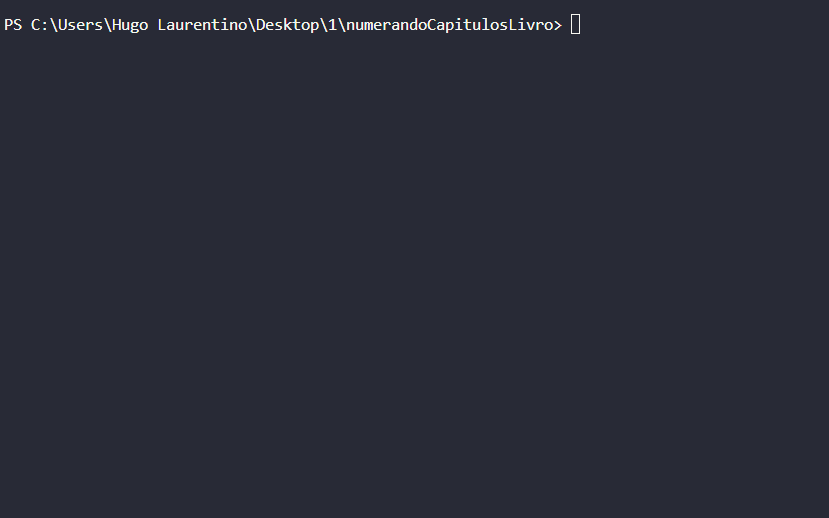

<h1 align="center">
  
</h1>

- [x] Bak-End
- [x] Criar Título
- [x] Criar Descrição
- [x] Sobre
- [x] Tecnologia
- [x] Pre requisito
- [x] Autor
- [x] GIF‘s

---
<h1 align='center'>Numerando capítulos de um livro</h1>

<p align='center'>Esse é um exemplo de lógica em javascript</p>
<p align='center'>
</p>

<p align='center'>
 <a href='#sobre'>Sobre</a> |
 <a href='#pré-requisitos'>Pre Requisitos</a> |
 <a href='#tecnologias'>Tecnologias</a> |
 <a href='#autor'>Autor</a>
</p>

---
<h1 align='center'>
 
</h1>
<p align='center'>
 Objetos livro, Lista (Array) de objetos capítulos , 2 constante do tipo lista novoCapitulo e novoLivro, for,  espalhamento e push
</p>
---

### Sobre

  <p align= 'justify'>
  Neste programa é feito para numerar uma sequencia de capítulos de um livro, que estava {nome: nome do livro, capítulos: [{nome: nome do capítulo}]} para {nome: nome do livro, capítulos: [{numero: numero do livro,nome: nome do capítulo}]}.
  Para isso foi preciso criar duas novas constantes.
  Usei um objeto livro dentro dele tem uma lista de capitulos com objetos, criei duas novas listas novoCapitulo já corrigindo com adição de numero que faltou no capitulo anterior e um novoLivro montando com o capitulo novo, for (loop) e espalhamento para imprimir na tela um console.log o novoLivro.
</p>

---

### Pré-requisitos

Antes de começar, você vai precisar ter instalado em sua máquina as seguintes FERRAMENTAS: [GIT](https://git-scm.com/), [Node.js](https://nodejs.org/en/download).
Além disto é bom ter um editor para trabalhar com o código como [VSCode](https://code.visualstudio.com/download).

### 🎲 Rodando o Back End

```bash
# Clone este repositório
$ git clone https://github.com/hugolaurentino/numerandoCapitulosLivro.git

# Acesse a pasta do projeto no terminal/cmd
$ cd numerandoCapitulosLivro

# Instale as dependências
$ npm install

# Execute 
$ node .\numerandoCapitulosLivro.js

```
### Tecnologias

As seguintes ferramentas foram usadas na construção do projeto:

- [Node.js][nodejs]

---
###### tags: `JavaScript` `nodeJS` `backend` `lógica` 
## Autor
Feito com ❤️ por Hugo Laurentino 👋🏽 [Entre em contato!](https://www.linkedin.com/in/hugo-laurentino-silva/)

[nodejs]: https://nodejs.org/
